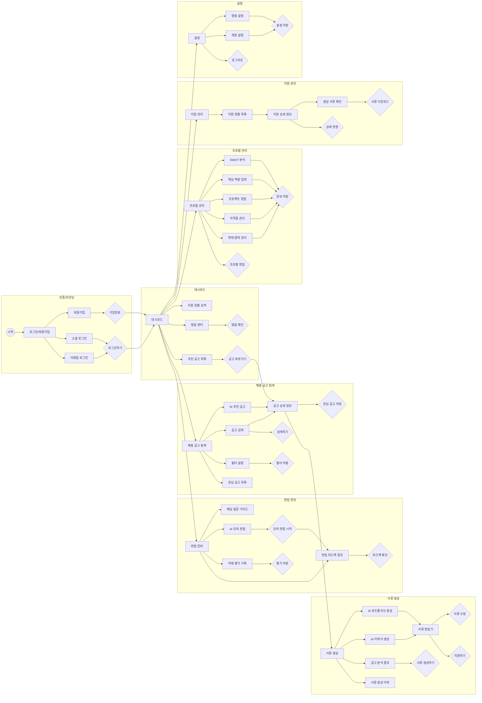

```mermaid
flowchart LR

  subgraph s1 ["인증/온보딩"]
    n1(("시작"))
    n2["로그인/회원가입"]
    n3["이메일 로그인"]
    n4["소셜 로그인"]
    n5["회원가입"]
    n6{"로그인하기"}
    n7{"가입완료"}
  end

  subgraph s2 ["대시보드"]
    n8["대시보드"]
    n9["지원 현황 요약"]
    n10["추천 공고 목록"]
    n11["알림 센터"]
    n12{"알림 확인"}
    n13{"공고 바로가기"}
  end

  subgraph s3 ["프로필 관리"]
    n14["프로필 관리"]
    n15["학력/경력 관리"]
    n16["자격증 관리"]
    n17["프로젝트 경험"]
    n18["핵심 역량 입력"]
    n19["SWOT 분석"]
    n20{"정보 저장"}
    n21{"프로필 편집"}
  end

  subgraph s4 ["채용 공고 탐색"]
    n22["채용 공고 탐색"]
    n23["공고 검색"]
    n24["필터 설정"]
    n25["AI 추천 공고"]
    n26["공고 상세 정보"]
    n27["관심 공고 목록"]
    n28{"검색하기"}
    n29{"필터 적용"}
    n30{"관심 공고 저장"}
  end

  subgraph s5 ["서류 생성"]
    n31["서류 생성"]
    n32["공고 분석 결과"]
    n33["AI 이력서 생성"]
    n34["AI 포트폴리오 생성"]
    n35["서류 편집기"]
    n36["서류 생성 이력"]
    n37{"서류 생성하기"}
    n38{"서류 수정"}
    n39{"지원하기"}
  end

  subgraph s6 ["면접 준비"]
    n40["면접 준비"]
    n41["예상 질문 가이드"]
    n42["AI 모의 면접"]
    n43["면접 피드백 결과"]
    n44["자체 평가 기록"]
    n45{"모의 면접 시작"}
    n46{"피드백 확인"}
    n47{"평가 저장"}
  end

  subgraph s7 ["지원 관리"]
    n48["지원 관리"]
    n49["지원 현황 목록"]
    n50["지원 상세 정보"]
    n51["생성 서류 확인"]
    n52{"상태 변경"}
    n53{"서류 다운로드"}
  end

  subgraph s8 ["설정"]
    n54["설정"]
    n55["계정 설정"]
    n56["알림 설정"]
    n57{"설정 저장"}
    n58{"로그아웃"}
  end

  n1 --> n2
  n2 --> n3
  n2 --> n4
  n2 --> n5
  n3 --> n6
  n4 --> n6
  n5 --> n7
  n6 --> n8
  n7 --> n8
  n8 --> n9
  n8 --> n10
  n8 --> n11
  n11 --> n12
  n10 --> n13
  n8 --> n14
  n14 --> n15
  n14 --> n16
  n14 --> n17
  n14 --> n18
  n14 --> n19
  n15 --> n20
  n16 --> n20
  n17 --> n20
  n18 --> n20
  n19 --> n20
  n14 --> n21
  n8 --> n22
  n22 --> n23
  n22 --> n24
  n22 --> n25
  n22 --> n27
  n23 --> n28
  n24 --> n29
  n23 --> n26
  n25 --> n26
  n26 --> n30
  n26 --> n31
  n31 --> n32
  n31 --> n33
  n31 --> n34
  n31 --> n36
  n33 --> n35
  n34 --> n35
  n32 --> n37
  n35 --> n38
  n35 --> n39
  n8 --> n40
  n40 --> n41
  n40 --> n42
  n40 --> n43
  n40 --> n44
  n42 --> n45
  n43 --> n46
  n44 --> n47
  n8 --> n48
  n48 --> n49
  n49 --> n50
  n50 --> n51
  n50 --> n52
  n51 --> n53
  n8 --> n54
  n54 --> n55
  n54 --> n56
  n55 --> n57
  n56 --> n57
  n54 --> n58
  n13 --> n26
  n45 --> n43
```
